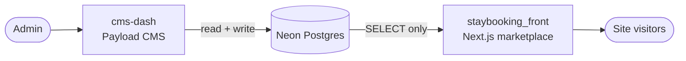

# payload-cms-demo
<div align="center">

# Payload CMS

*Short-stays booking marketplace — a Payload CMS dashboard and a read-only Next.js storefront, backed by Neon Postgres*

[](https://nextjs.org)
[](https://payloadcms.com)
[](https://neon.tech)
[](https://orm.drizzle.team)
[](https://workers.cloudflare.com)
[](https://www.typescriptlang.org)

[Features](#features) • [Architecture](#architecture) • [Project structure](#project-structure) • [Getting started](#getting-started) • [Deployment](#deployment)

</div>

A demo short-stays (vacation-rental) marketplace split into two independent Next.js apps that share one [Neon](https://neon.tech) Postgres database — and nothing else.

**`cms-dash`** is the [Payload](https://payloadcms.com) admin dashboard where every listing and taxonomy value is managed. **`staybooking_front`** is the public storefront that reads the same data straight from the database through a SELECT-only role. There is no API between the two apps: the storefront queries Neon directly from React Server Components, so both apps stay simple and deploy independently to Cloudflare.


## Features

- **Marketplace storefront** — server-rendered stay cards (image, property & stay type badges, per-night price, location, amenity icons) with text search, a price-range slider, and multi-select filters synced to the URL, so any filtered view is shareable and bookmarkable.
- **Payload admin dashboard** — manage stays, locations, property types, stay types, and amenities; the Postgres schema is owned by Payload migrations, with an idempotent seed script for demo data.
- **Data-driven taxonomy** — every filter option comes straight from a lookup table. Add a city or amenity in the admin and it shows up as a new filter option and card badge with zero code changes.
- **Enforced read-only frontend** — the storefront connects with a dedicated SELECT-only Postgres role. A SQL script provisions it and a verification script proves it can read but not write.
- **Cloudflare-ready by design** — queries run over Neon's HTTP (fetch-based) driver and the apps never call each other, so each one deploys independently to Workers/Pages.

## Architecture



- **`cms-dash`** — Next.js + Payload with the Postgres adapter (Drizzle under the hood). It is the **only writer**. Collections: `Stays`, `Locations`, `Property Types`, `Stay Types`, `Amenities`, `Users`. Everything lives under `/admin`; the root URL redirects there.
- **`staybooking_front`** — Next.js App Router storefront. Server components fetch data through a read-only Drizzle client built on `@neondatabase/serverless`, and filter state lives entirely in the URL.
- **Neon Postgres** — the single source of truth. Lookup tables (`locations`, `property_types`, `stay_types`, `amenities`), the `stays` table referencing them by foreign keys, plus Payload-managed child tables for image URLs and amenity relations. The database stores image **URLs only** — binaries live wherever the images are hosted.

> [!IMPORTANT]
> **The read-only contract is the core of this architecture.** `cms-dash` must be the only writer. `staybooking_front` must never hold credentials with `INSERT`/`UPDATE`/`DELETE`/DDL privileges — not locally, not in production.

## Project structure

```
.
├── cms-dash/                  # Payload CMS admin dashboard (read + write)
│   ├── payload.config.ts      # Payload config (Postgres adapter, migrations)
│   ├── src/collections/       # Users, Locations, PropertyTypes, StayTypes, Amenities, Stays
│   ├── src/migrations/        # Postgres schema, owned by Payload
│   └── src/seed.ts            # Idempotent seed: lookup rows + sample stays
├── staybooking_front/         # Public marketplace (read-only)
│   ├── app/                   # App Router pages (server components)
│   ├── components/            # Marketplace UI (filters, cards) + UI primitives
│   ├── lib/db/                # Read-only Drizzle schema + Neon HTTP client
│   ├── lib/queries.ts         # SELECT-only data-fetching layer
│   └── scripts/               # readonly-role.sql + verify-readonly.ts
└── AGENTS.md                  # Architecture rules & conventions
```

## Getting started

Prerequisites:

- [Node.js](https://nodejs.org) 20+ and npm
- A [Neon](https://neon.tech) project (the free tier is fine) with an admin connection string

### 1. Set up the database and admin dashboard

```bash
cd cms-dash
npm install
```

Create `cms-dash/.env`:

```env
DATABASE_URI=postgresql://<admin-user>:<password>@<host>-pooler.<region>.aws.neon.tech/neondb?sslmode=require
PAYLOAD_SECRET=<any-long-random-string>
# NEXT_PUBLIC_SERVER_URL=https://your-deployed-admin.example.com  (optional)
```

Apply the schema, seed demo data, and start the dashboard:

```bash
npm run migrate     # creates the tables from Payload migrations
npm run seed        # lookup rows (cities, BHK types, amenities…) + 3 sample stays
npm run dev         # open http://localhost:3000 → /admin, create the first admin user
```

> [!TIP]
> Payload's Postgres adapter uses the raw `pg` driver, which occasionally trips over PgBouncer's prepared statements on the pooled endpoint. If a migration fails with a prepared-statement error, temporarily use Neon's **direct** (non-pooler) connection string, run the migration, then switch back.

### 2. Create the read-only role

Run [`staybooking_front/scripts/readonly-role.sql`](staybooking_front/scripts/readonly-role.sql) in the Neon SQL editor while logged in as the project owner. Replace the placeholder password and the admin role name in the default-privileges clause, then build the pooled connection string for the new `staybooking_readonly` role.

### 3. Run the storefront

```bash
cd ../staybooking_front
npm install
```

Create `staybooking_front/.env.local`:

```env
DATABASE_READONLY_URL=postgresql://staybooking_readonly:<password>@<host>-pooler.<region>.aws.neon.tech/neondb?sslmode=require
```

Verify the read-only contract — the script should report that reads work and writes are rejected by Postgres:

```bash
npx tsx scripts/verify-readonly.ts
npm run dev         # http://localhost:3000
```

## Environment variables

| App                 | File         | Variable                | Description                                        |
| ------------------- | ------------ | ----------------------- | -------------------------------------------------- |
| `cms-dash`          | `.env`       | `DATABASE_URI`          | Neon admin connection string (pooled)              |
| `cms-dash`          | `.env`       | `PAYLOAD_SECRET`        | Secret used by Payload for auth/crypto             |
| `cms-dash`          | `.env`       | `NEXT_PUBLIC_SERVER_URL`| Optional public URL of the deployed dashboard      |
| `staybooking_front` | `.env.local` | `DATABASE_READONLY_URL` | Connection string of the SELECT-only Postgres role |

## Scripts

**`cms-dash`**

| Command                  | Description                                              |
| ------------------------ | -------------------------------------------------------- |
| `npm run dev`            | Start the admin dashboard in dev mode                    |
| `npm run build` / `start`| Production build / serve                                 |
| `npm run migrate`        | Apply pending Payload migrations                         |
| `npm run migrate:create` | Generate a migration from collection config changes      |
| `npm run migrate:fresh`  | Drop and recreate the schema, then re-apply (destructive)|
| `npm run seed`           | Idempotent seed of lookup rows and sample stays          |
| `npm run generate:types` | Regenerate Payload TypeScript types                      |

**`staybooking_front`**

| Command                          | Description                                   |
| -------------------------------- | --------------------------------------------- |
| `npm run dev`                    | Start the storefront in dev mode              |
| `npm run build` / `start` / `lint` | Standard Next.js scripts                    |
| `npx tsx scripts/verify-readonly.ts` | Verify the SELECT-only database contract  |

## Adding new filter options

New cities, property types, stay types, or amenities are **just data**: add a row in the matching Payload collection (or `INSERT` into the lookup table). The storefront's filter sidebar and card badges read these tables on every render, so new values appear automatically — no code change, no redeploy. Stays always reference lookup rows by foreign key, never by copied strings, so renames and edits propagate everywhere.

## Deployment

Both apps are designed to deploy independently to Cloudflare Workers/Pages via [OpenNext](https://opennext.js.org) / `@opennextjs/cloudflare` and Wrangler:

- The **storefront** is Workers-ready out of the box: Neon's HTTP driver sends queries over `fetch`, which the Workers runtime supports. Set the read-only role's connection string as a Worker secret.
- The **admin dashboard** uses Payload's `pg`-based adapter (raw TCP), which requires [Hyperdrive](https://developers.cloudflare.com/hyperdrive/) or a compatible TCP proxy in a Worker environment.

No Wrangler configs are committed yet; see [`AGENTS.md`](AGENTS.md) for the architecture rules and conventions any deployment should follow.
